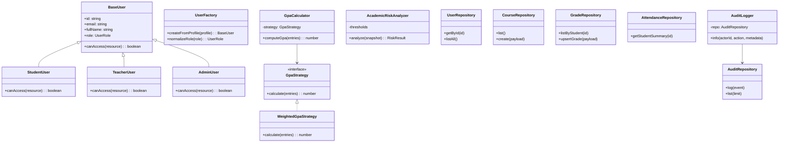

# Class Diagram

```mermaid
classDiagram
    class BaseUser {
      +id: string
      +email: string
      +fullName: string
      +role: UserRole
      +canAccess(resource): boolean
    }

    class StudentUser {
      +canAccess(resource): boolean
    }

    class TeacherUser {
      +canAccess(resource): boolean
    }

    class AdminUser {
      +canAccess(resource): boolean
    }

    BaseUser <|-- StudentUser
    BaseUser <|-- TeacherUser
    BaseUser <|-- AdminUser

    class UserFactory {
      +createFromProfile(profile): BaseUser
      +normalizeRole(role): UserRole
    }

    class GpaStrategy {
      <<interface>>
      +calculate(entries): number
    }

    class WeightedGpaStrategy {
      +calculate(entries): number
    }

    class GpaCalculator {
      -strategy: GpaStrategy
      +computeGpa(entries): number
    }

    GpaStrategy <|.. WeightedGpaStrategy
    GpaCalculator --> GpaStrategy

    class AcademicRiskAnalyzer {
      -thresholds
      +analyze(snapshot): RiskResult
    }

    class UserRepository {
      +getById(id)
      +listAll()
    }

    class CourseRepository {
      +list()
      +create(payload)
    }

    class GradeRepository {
      +listByStudent(id)
      +upsertGrade(payload)
    }

    class AttendanceRepository {
      +getStudentSummary(id)
    }

    class AuditRepository {
      +log(event)
      +list(limit)
    }

    class AuditLogger {
      -repo: AuditRepository
      +info(actorId, action, metadata)
    }

    AuditLogger --> AuditRepository
```
