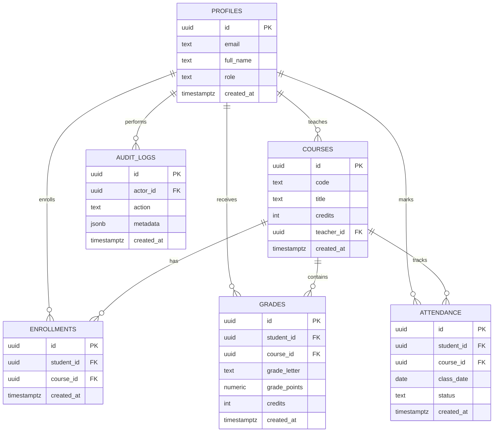

# ER Diagram

```mermaid
erDiagram
    PROFILES {
        uuid id PK
        text email
        text full_name
        text role
        timestamptz created_at
    }

    COURSES {
        uuid id PK
        text code
        text title
        int credits
        uuid teacher_id FK
        timestamptz created_at
    }

    ENROLLMENTS {
        uuid id PK
        uuid student_id FK
        uuid course_id FK
        timestamptz created_at
    }

    GRADES {
        uuid id PK
        uuid student_id FK
        uuid course_id FK
        text grade_letter
        numeric grade_points
        int credits
        timestamptz created_at
    }

    ATTENDANCE {
        uuid id PK
        uuid student_id FK
        uuid course_id FK
        date class_date
        text status
        timestamptz created_at
    }

    AUDIT_LOGS {
        uuid id PK
        uuid actor_id FK
        text action
        jsonb metadata
        timestamptz created_at
    }

    PROFILES ||--o{ COURSES : teaches
    PROFILES ||--o{ ENROLLMENTS : enrolls
    COURSES ||--o{ ENROLLMENTS : has
    PROFILES ||--o{ GRADES : receives
    COURSES ||--o{ GRADES : contains
    PROFILES ||--o{ ATTENDANCE : marks
    COURSES ||--o{ ATTENDANCE : tracks
    PROFILES ||--o{ AUDIT_LOGS : performs
```
