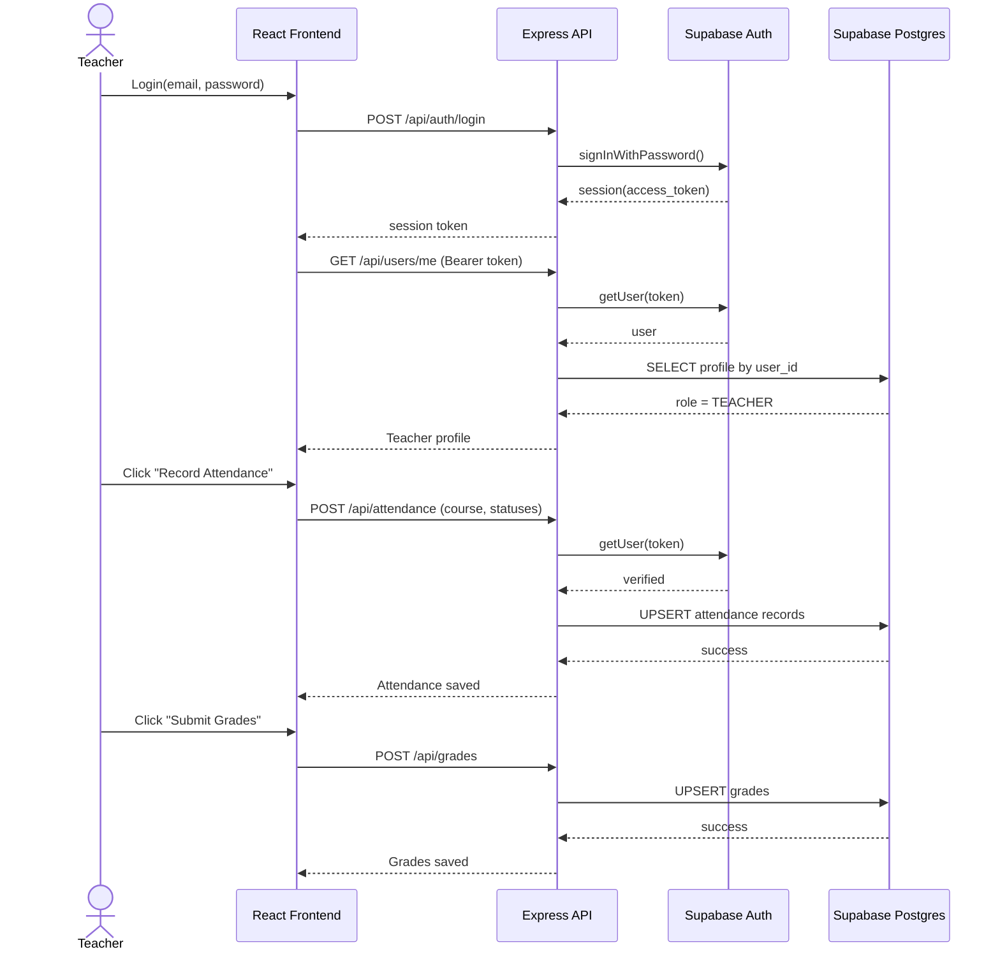

# Sequence Diagram

```mermaid
sequenceDiagram
    actor Teacher
    participant Frontend as React Frontend
    participant Backend as Express API
    participant Auth as Supabase Auth
    participant DB as Supabase Postgres

    Teacher->>Frontend: Login(email, password)
    Frontend->>Backend: POST /api/auth/login
    Backend->>Auth: signInWithPassword()
    Auth-->>Backend: session(access_token)
    Backend-->>Frontend: session token

    Frontend->>Backend: GET /api/users/me (Bearer token)
    Backend->>Auth: getUser(token)
    Auth-->>Backend: user
    Backend->>DB: SELECT profile by user_id
    DB-->>Backend: role = TEACHER
    Backend-->>Frontend: Teacher profile

    Teacher->>Frontend: Click "Record Attendance"
    Frontend->>Backend: POST /api/attendance (course, statuses)
    Backend->>Auth: getUser(token)
    Auth-->>Backend: verified
    Backend->>DB: UPSERT attendance records
    DB-->>Backend: success
    Backend-->>Frontend: Attendance saved

    Teacher->>Frontend: Click "Submit Grades"
    Frontend->>Backend: POST /api/grades
    Backend->>DB: UPSERT grades
    DB-->>Backend: success
    Backend-->>Frontend: Grades saved
```
