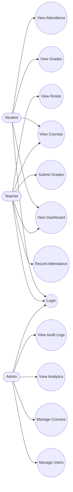

# Use Case Diagram

```mermaid
flowchart LR
    Student([Student])
    Teacher([Teacher])
    Admin([Admin])

    UC1((Login))
    UC2((View Dashboard))
    UC3((View Courses))
    UC4((View Grades))
    UC5((View Attendance))
    UC6((Record Attendance))
    UC7((Submit Grades))
    UC8((View Roster))
    UC9((Manage Users))
    UC10((Manage Courses))
    UC11((View Analytics))
    UC12((View Audit Logs))

    Student --> UC1
    Student --> UC2
    Student --> UC3
    Student --> UC4
    Student --> UC5

    Teacher --> UC1
    Teacher --> UC2
    Teacher --> UC3
    Teacher --> UC6
    Teacher --> UC7
    Teacher --> UC8

    Admin --> UC1
    Admin --> UC9
    Admin --> UC10
    Admin --> UC11
    Admin --> UC12
```
